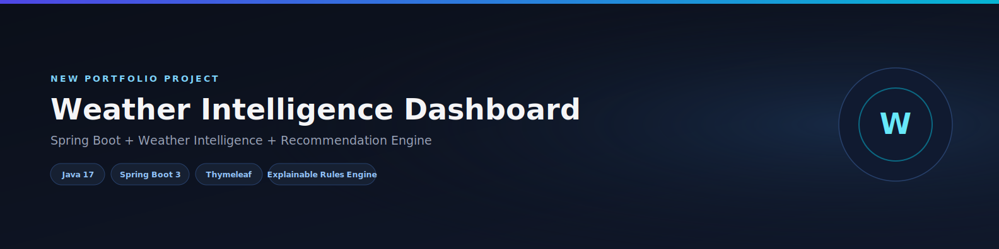
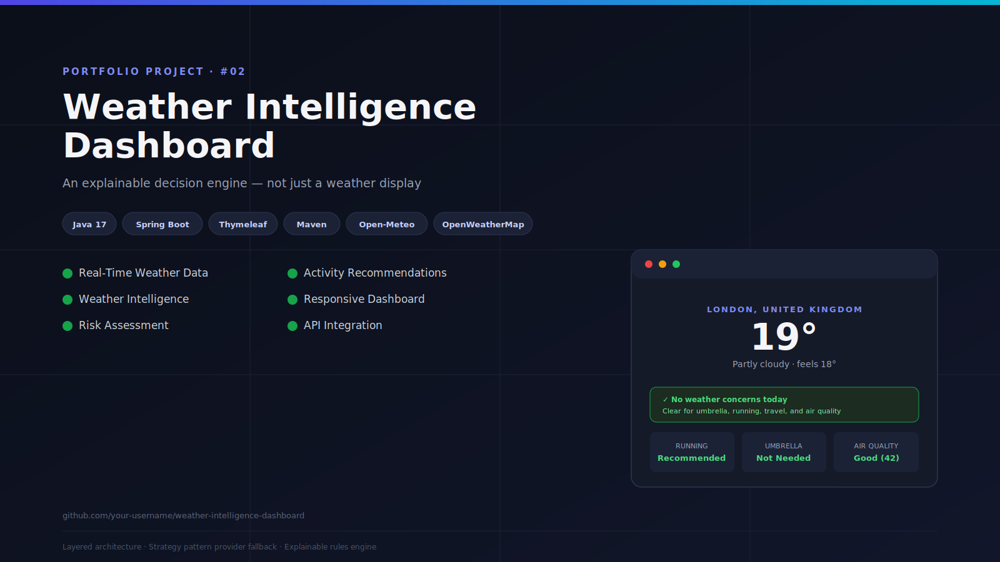
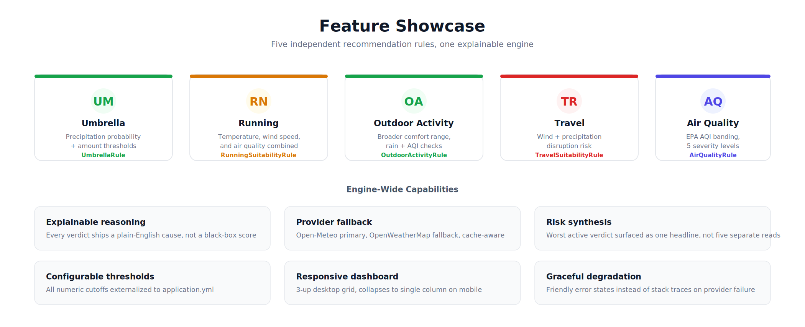
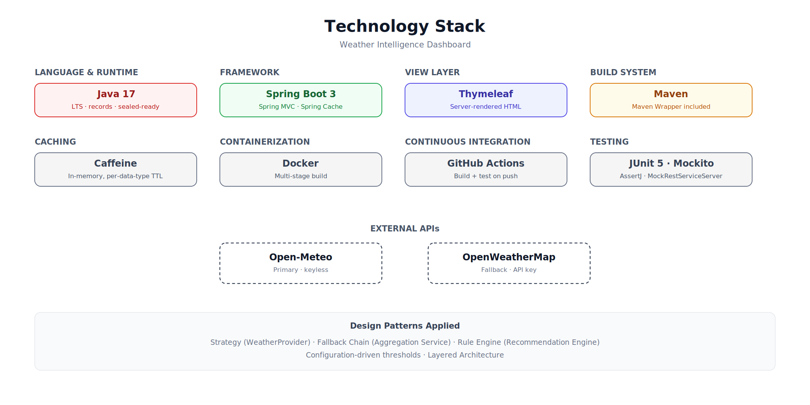
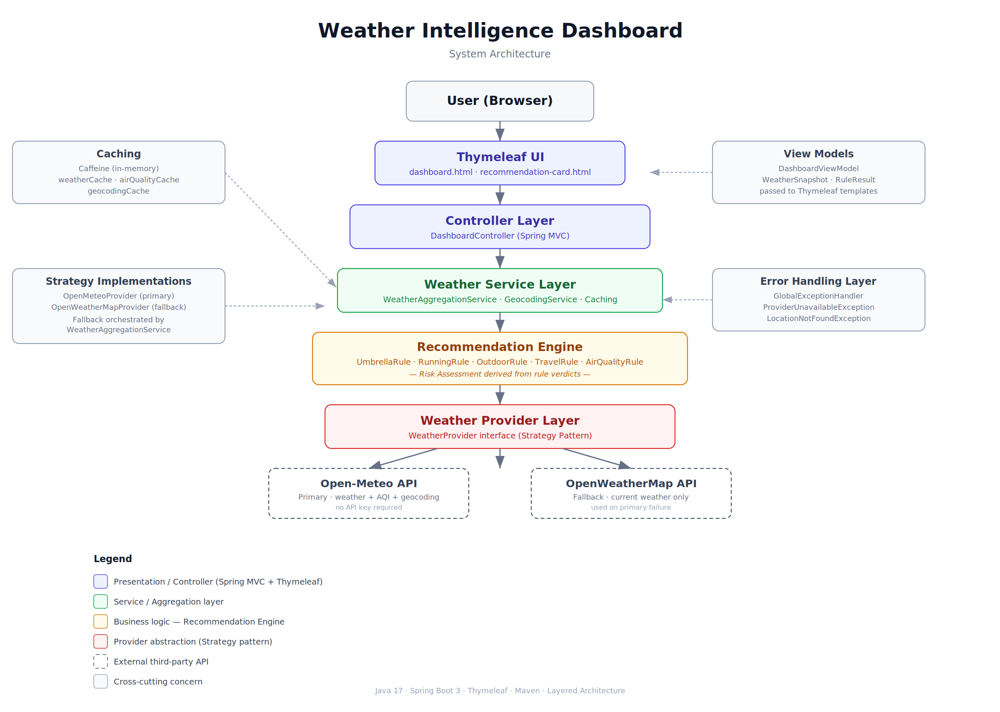
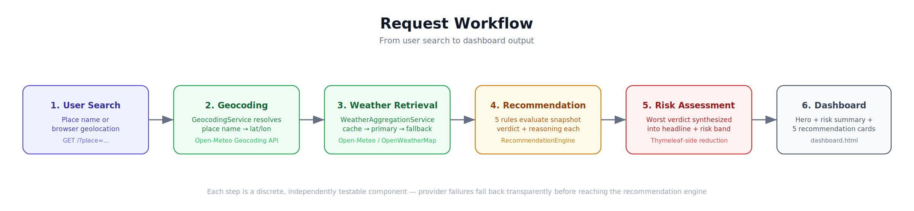
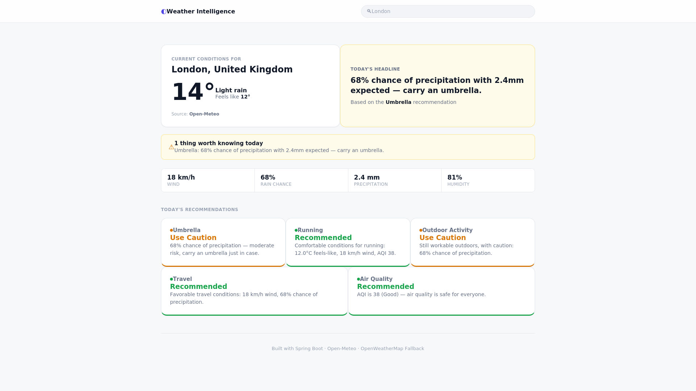
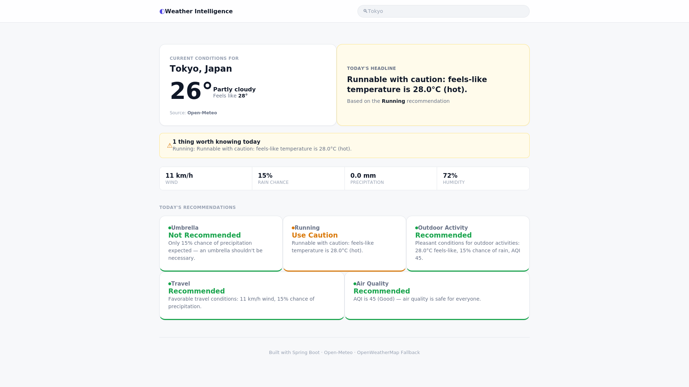
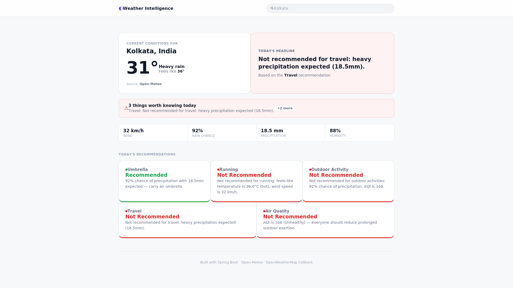
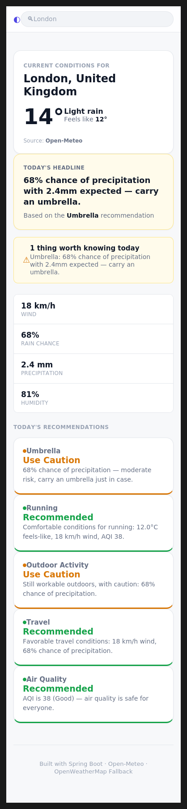

<div align="center">



# Weather Intelligence Dashboard

**An explainable decision engine for weather-driven decisions — not just another weather display.**

[](https://openjdk.org/)
[](https://spring.io/projects/spring-boot)
[](https://maven.apache.org/)
[](#)

</div>

---

## Project Overview

Weather Intelligence Dashboard ingests raw meteorological data and runs it through a rules-based recommendation engine that answers specific, practical questions — *should I carry an umbrella, is today good for a run, is the air safe to breathe, will this disrupt travel* — instead of just rendering a temperature.

Every verdict ships with a plain-English reasoning trace tied to the exact factor that drove it. The engine is provider-agnostic and fails over cleanly when the primary weather API is unavailable.

---

## Project Preview

<div align="center">

</div>

---

## Project Stats

| | |
|---|---|
| **Language** | Java 17 |
| **Framework** | Spring Boot 3 |
| **View Layer** | Thymeleaf |
| **Build Tool** | Maven |
| **Recommendation Rules** | 5 independently testable rules |
| **Resilience** | Provider fallback (Strategy pattern) |
| **UI** | Responsive dashboard (desktop → mobile) |

---

## What This Project Demonstrates

| Skill | Where |
|---|---|
| **Spring Boot Development** | Layered Spring MVC application — controllers, services, configuration binding |
| **Layered Architecture** | Strict Controller → Service → Engine → Provider flow, no layer-skipping |
| **Strategy Pattern** | `WeatherProvider` interface with interchangeable primary/fallback implementations; `Rule` interface for independent recommendation logic |
| **API Integration** | Two external weather APIs normalized into one internal domain model |
| **Recommendation Engine Design** | Five independent, single-purpose rule classes producing verdicts with explainable reasoning |
| **Caching** | Named in-memory caches with per-data-type TTLs |
| **Error Handling** | Centralized exception handling with graceful fallback instead of stack traces |
| **Responsive UI** | Desktop grid that collapses cleanly to mobile single-column |

---

## Key Features

<div align="center">

</div>

- **Umbrella Rule** — precipitation probability + amount thresholds
- **Running Suitability Rule** — temperature, wind, and air quality combined
- **Outdoor Activity Rule** — broader comfort range, rain + AQI aware
- **Travel Suitability Rule** — wind and precipitation disruption risk
- **Air Quality Rule** — AQI banding across multiple severity levels
- **Provider Fallback** — primary provider with a documented fallback path

<table>
<tr>
<td></td>
<td></td>
</tr>
<tr>
<td align="center"><sub>Recommendation Card</sub></td>
<td align="center"><sub>Risk Summary</sub></td>
</tr>
</table>

---

## Technology Stack

<div align="center">

</div>

| Layer | Technology |
|---|---|
| Language/Runtime | Java 17 |
| Framework | Spring Boot 3 (Spring MVC) |
| View Layer | Thymeleaf |
| Build System | Maven |
| Caching | In-memory cache, per-data-type TTL |
| External APIs | Open-Meteo (primary), OpenWeatherMap (fallback) |

---

## Architecture

<div align="center">

</div>

**Controller Layer** — Orchestrates the request lifecycle only. No weather logic, no provider knowledge, no recommendation logic lives here.

**Service Layer** — Owns caching, provider orchestration, and fallback resolution.

**Recommendation Engine** — Evaluates every registered rule against the current snapshot. Adding a new rule means writing one new class — no changes to the engine, controller, or templates.

**Provider Layer** — A Strategy interface implemented by a primary and a fallback provider. Each implementation translates its provider-specific response into the application's normalized domain model.

**API Layer (External)** — Open-Meteo supplies weather, air quality, and geocoding, keyless. OpenWeatherMap is the documented fallback, used only on primary failure.

---

## Request Workflow

<div align="center">

</div>

```
User Search → Geocoding → Weather Retrieval → Recommendation Engine → Risk Assessment → Dashboard Output
```

1. **User Search** — a place name or browser geolocation is submitted.
2. **Geocoding** — the place name is resolved to coordinates via a keyless geocoding endpoint.
3. **Weather Retrieval** — cache is checked first, then the primary provider, falling back to the secondary provider on failure.
4. **Recommendation Engine** — all five rules evaluate the normalized snapshot independently.
5. **Risk Assessment** — the most severe active verdict is synthesized into a single headline.
6. **Dashboard Output** — the view model is rendered as the hero section, risk summary, and recommendation grid.

---

## Screenshots

<table>
<tr>
<td align="center"><b>Balanced Weather Scenario</b></td>
<td align="center"><b>Rain Risk Scenario</b></td>
<td align="center"><b>Severe Weather Scenario</b></td>
</tr>
<tr>
<td></td>
<td></td>
<td></td>
</tr>
</table>

<div align="center">

</div>

---

## Engineering Highlights

- **Layered Architecture** — strict Controller → Service → Engine → Provider flow; provider-specific response shapes never leak past the adapter boundary.
- **Strategy Pattern** — both the provider layer and the rules engine are built on interchangeable interface implementations.
- **Provider Fallback** — primary/secondary provider resolution lives in one orchestration point, with explicit timeouts so a slow third party can't hang a request.
- **Explainable Rules Engine** — every verdict carries a reasoning string citing the specific factor that drove it.
- **Cache Layer** — independently tuned TTLs per data type rather than one blanket policy.
- **Responsive UI** — a desktop grid that collapses cleanly to a single column on mobile.
- **Error Handling** — a global exception handler renders a friendly error state instead of a stack trace.

---

## Installation

No API key is required to run this locally — Open-Meteo, the primary provider, is keyless.

```bash
git clone https://github.com/PawanChoudhary0607/weather-intelligence-dashboard.git
cd weather-intelligence-dashboard
./mvnw spring-boot:run
```

Open the application:

```
http://localhost:8080
```

If OpenWeatherMap fallback is configured:

```bash
export OPENWEATHERMAP_API_KEY=your_api_key
./mvnw spring-boot:run
```

---

## Usage

1. Open the dashboard and either allow browser geolocation or type a place name into the search bar.
2. The hero section shows current temperature, conditions, and a synthesized headline for the day.
3. The risk summary band surfaces the most severe active concern, if any.
4. The recommendation grid breaks down all five verdicts, each with its own reasoning.
5. If the primary provider is unavailable, the dashboard transparently serves fallback data.

---

## Future Improvements

- "What to wear" layered clothing recommendation rule
- User profiles with personalized sensitivity thresholds
- Historical trend visualization
- Authentication and saved locations

---

## Author

**Pawan Choudhary**

B.Tech CSE (AI/ML)

GitHub: [https://github.com/PawanChoudhary0607](https://github.com/PawanChoudhary0607)

LinkedIn: [https://www.linkedin.com/in/pawan-choudhary-a61a61383](https://www.linkedin.com/in/pawan-choudhary-a61a61383)

Portfolio: [https://your-portfolio-link.com](https://your-portfolio-link.com)

---

<div align="center">

If this project was useful or interesting, consider leaving a ⭐ on the repository.

</div>
